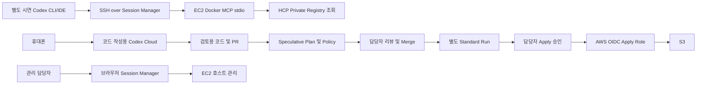

# 사전 요구사항과 실행 환경

## 환경 및 권한 분리

| 주체 | 최소 역할 | 제공하지 않을 권한 |
|---|---|---|
| Codex Cloud | 저장소 파일 수정, 격리된 검사 | AWS/HCP 배포 자격증명 |
| EC2 Instance Profile | AmazonSSMManagedInstanceCore | 데모 S3 변경, Registry Token 관리 |
| 호스트 담당자 | 해당 EC2의 브라우저 SSM 관리 | 시연 AI에 관리자 역할 전달 |
| 시연 Client의 AWS 로그인 | 해당 EC2 + AWS-StartSSHSession만 | 브라우저 Shell, SendCommand, IAM 변경 |
| mcp-client OS 계정 | Root 소유 고정 런처만 sudo | 범용 sudo, docker 그룹, 호스트 파일 수정 |
| MCP HCP Token | Private Module 및 지정 Workspace/Run 조회 | Workspace 생성·변경, Run 생성·Apply, Policy 변경 |
| HCP Plan Role | 정확한 Bucket의 조회 | CreateBucket 등 변경 |
| HCP Apply Role | 정확한 Bucket의 필요한 S3 변경 | IAM, EC2, Object 쓰기/삭제, 다른 Bucket |

MCP Token은 HCP Team의 최소 접근을 우선 검토합니다. HCP의 권한 단위가 Module별로 제한되는지, Workspace read가 State 읽기를 포함하는지는 실제 Organization에서 확인해야 합니다. Organization Token/관리자 Token을 기본값으로 사용하지 않습니다. 조회에 필요하지 않은 Workspace 접근은 제외합니다.

SSM 관리 Profile이 있어도 컨테이너에서 Instance Metadata를 사용할 수 있으면 역할 분리가 약해집니다. IMDSv2 hop limit 1, IPv4 link-local 차단, IPv6가 없는 전용 Docker bridge, 호스트 INPUT 차단을 함께 준비했습니다. 호스트 root/Docker daemon 권한은 여전히 강한 권한이며 이 경계의 신뢰 주체입니다.

## Phase 2 시작 전

AWS 계정/Region/기존 VPC·Subnet·AL2023 x86_64 AMI, egress 경로, 비용, 안전한 State 저장/잠금/백업, SSO/MFA 운영 권한을 확정합니다. HCP Organization/Project/Workspace, VCS 연결 권한, 실제 Module Source/Version, Sentinel entitlement를 확인합니다. 입력 목록은 `reports/required-inputs.md`에 있습니다.

검증 실행 환경은 Linux x86_64, Python 3.11 이상, Terraform 1.13.5, Sentinel 0.40.0, ShellCheck, Git, Docker daemon과 공개 dependency 다운로드 네트워크가 필요합니다. 시연용 Client에는 별도로 Codex CLI/IDE, AWS CLI, Session Manager plugin, OpenSSH가 필요합니다. Cloud에서 작성한 config가 다른 Client에 자동으로 전달되지는 않습니다.

EC2는 t3.small, gp3 20 GiB를 제안합니다. EC2/EBS, 기존 egress의 NAT 처리, 선택한 VPC endpoint, 로그 저장, HCP 구독 비용은 실제 Region/계약에서 확인합니다. 코드가 새 VPC, NAT Gateway, ALB 또는 VPC endpoint를 자동 생성하지 않습니다. 기존 TFE VM과 고객 환경은 사용하지 않습니다.
